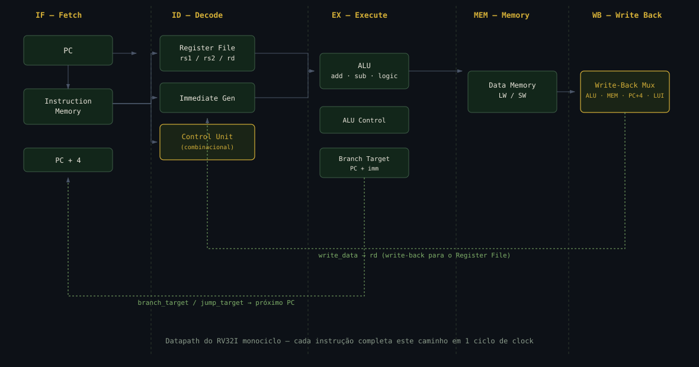

<h1 align="center">RV32I Monocycle Processor</h1>

<h4 align="center">
Implementação de um processador RISC-V de 32 bits (RV32I), arquitetura monociclo — cada instrução executa em exatamente um ciclo de clock.
</h4>

<p align="center">


</p>

<p align="center">
<a href="#-visão-geral">Visão Geral</a> •
<a href="#-datapath">Datapath</a> •
<a href="#-arquitetura-do-sistema">Arquitetura</a> •
<a href="#-guia-de-compilação-e-simulação">Como Simular</a> •
<a href="#-documentação-técnica-completa">Documentação Completa</a>
</p>

---

## 🎯 Visão Geral

Processador RISC-V RV32I completo, implementado do zero em Verilog com arquitetura **monociclo (single-cycle)**: cada instrução — busca, decodificação, execução, acesso à memória e escrita de volta — é resolvida em uma única borda de clock, sem pipeline.

Cobre as **30 instruções da ISA RV32I** (aritmética, lógica, load/store, branch e jump), com testbench próprio validando cada uma.

### Especificações Técnicas

| Característica | Valor |
|---|---|
| Arquitetura | RISC-V RV32I |
| Tipo | Monociclo (Single-Cycle) |
| Barramento de dados / endereços | 32 bits |
| Registradores | 32 (x0 a x31) |
| Memória de instruções | 256 palavras (1 KB) |
| Memória de dados | 256 palavras (1 KB) |
| Clock | Fase única, borda de subida |

## 🖼️ Datapath

<p align="center">
  
</p>

<p align="center"><i>Caminho de dados completo: IF → ID → EX → MEM → WB, com realimentação de write-back para o Register File e de branch/jump para o PC.</i></p>


---

## 📚 Documentação Técnica Completa

## 🏗️ **Arquitetura do Sistema**

### Os 5 Estágios do Processador

```
    +--------+     +--------+     +--------+     +--------+     +--------+
    |   IF   | --> |   ID   | --> |   EX   | --> |  MEM   | --> |   WB   |
    | Fetch  |     | Decode |     |Execute |     | Memory |     | Write  |
    |        |     |        |     |        |     | Access |     | Back   |
    +--------+     +--------+     +--------+     +--------+     +--------+
         |              |              |              |              |
         v              v              v              v              v
    PC, PC+4,      RegFile,      ULA, ALU      Data Memory    Mux Write
    Instr Mem      ImmGen,       Control,      (LW/SW)        Back
                   Control       Muxes
                   Unit
```

### Fluxo de Dados por Estágio

#### **1. IF (Instruction Fetch)** - Busca da Instrução
- **Entrada**: Clock, reset, sinais de branch/jump
- **Processamento**: 
  - PC atual busca instrução na memória
  - Calcula PC+4 para próxima instrução sequencial
  - Decide próximo PC (sequencial, branch ou jump)
- **Saída**: Instrução de 32 bits, PC+4

#### **2. ID (Instruction Decode)** - Decodificação
- **Entrada**: Instrução de 32 bits
- **Processamento**:
  - Decodifica opcode, funct3, funct7
  - Lê registradores fonte (rs1, rs2)
  - Gera imediato estendido
  - Unidade de Controle gera sinais
- **Saída**: Valores de rs1, rs2, imediato, sinais de controle

#### **3. EX (Execute)** - Execução
- **Entrada**: rs1, rs2, imediato, sinais de controle
- **Processamento**:
  - ULA executa operação (ADD, SUB, AND, OR, etc.)
  - Calcula endereço de branch (PC + imm)
  - Gera flag zero para branches
- **Saída**: Resultado da ULA, flag zero, branch target

#### **4. MEM (Memory Access)** - Acesso à Memória
- **Entrada**: Endereço, dado a armazenar, sinais mem_read/mem_write
- **Processamento**:
  - LW: Lê dado da memória de dados
  - SW: Escreve dado na memória de dados
- **Saída**: Dado lido da memória (se LW)

#### **5. WB (Write Back)** - Escrita no Registrador
- **Entrada**: Resultado ULA, dado da memória, PC+4
- **Processamento**:
  - Seleciona fonte do dado (ULA, memória, PC+4, imediato LUI)
- **Saída**: Dado final a ser escrito no registrador destino

---

## 📁 **Estrutura do Projeto**

```
projeto_rv32i/
│
├── 📁 src/                          # Código fonte Verilog
│   ├── 📄 top_processor.v           # Módulo principal (integra tudo)
│   ├── 📄 if_stage.v               # Estágio 1: Instruction Fetch
│   ├── 📄 id_stage.v               # Estágio 2: Instruction Decode
│   ├── 📄 ex_stage.v               # Estágio 3: Execute
│   ├── 📄 mem_stage.v              # Estágio 4: Memory Access
│   ├── 📄 wb_stage.v               # Estágio 5: Write Back
│   ├── 📄 control_unit.v           # Unidade de Controle (combinacional)
│   ├── 📄 alu.v                    # Unidade Lógica e Aritmética
│   ├── 📄 alu_control.v            # Controle da ULA
│   ├── 📄 reg_file.v               # Banco de Registradores
│   └── 📄 imm_gen.v                # Gerador de Imediatos
│
├── 📁 tb/                           # Testbench
│   └── 📄 tb_top_processor.v       # Testbench principal
│
├── 📁 programs/                     # Programas de teste
│   ├── 📄 test_all_instr.s         # Assembly (todas as instruções)
│   └── 📄 test_all_instr.hex       # Código de máquina (hex)
│
├── 📁 docs/                         # Documentação
│   └── 📄 relatorio.pdf            # Relatório técnico
│
├── 📁 sim/                          # Resultados de simulação
│   └── 📄 waveform.vcd             # Formas de onda
│
└── 📄 README.md                    # Este arquivo
```

### Dependências entre Módulos

```
top_processor.v
├── if_stage.v
│   └── (memória de instruções interna)
├── id_stage.v
│   ├── reg_file.v
│   ├── imm_gen.v
│   └── control_unit.v (instanciada também no top)
├── ex_stage.v
│   ├── alu.v
│   └── alu_control.v
├── mem_stage.v
│   └── (memória de dados interna)
└── wb_stage.v
    └── (multiplexadores internos)
```

---

## 📦 **Descrição dos Módulos**

### `top_processor.v` - Processador Principal
**Tamanho**: ~200 linhas
**Função**: Integrar todos os estágios e gerenciar o fluxo de dados
**Portas**:
| Porta | Direção | Tamanho | Descrição |
|-------|---------|---------|-----------|
| clk | input | 1 | Clock do sistema |
| reset | input | 1 | Reset síncrono (ativa alto) |

**Submódulos instanciados**: Todos os 5 estágios + control_unit

---

### `if_stage.v` - Instruction Fetch
**Tamanho**: ~50 linhas
**Função**: Buscar instrução e calcular próximo PC

**Portas**:
| Porta | Direção | Tamanho | Descrição |
|-------|---------|---------|-----------|
| clk | input | 1 | Clock |
| reset | input | 1 | Reset |
| branch_taken | input | 1 | Branch foi tomado? |
| jump | input | 1 | É instrução de jump? |
| branch_target | input | 32 | Endereço alvo do branch |
| jump_target | input | 32 | Endereço alvo do jump |
| pc | output | 32 | Program Counter atual |
| pc_plus_4 | output | 32 | PC + 4 |
| instr | output | 32 | Instrução lida da memória |

**Lógica**:
```
next_pc = jump ? jump_target : (branch_taken ? branch_target : pc+4)
```

---

### `id_stage.v` - Instruction Decode
**Tamanho**: ~40 linhas
**Função**: Decodificar instrução e gerar sinais de controle

**Portas**:
| Porta | Direção | Tamanho | Descrição |
|-------|---------|---------|-----------|
| clk | input | 1 | Clock (para RegFile) |
| instr | input | 32 | Instrução a decodificar |
| write_data | input | 32 | Dado de write-back |
| rd_addr | input | 5 | Registrador destino |
| reg_write | input | 1 | Habilita escrita |
| rs1_data | output | 32 | Valor de rs1 |
| rs2_data | output | 32 | Valor de rs2 |
| imm | output | 32 | Imediato estendido |
| alu_src | output | 1 | Seleciona imediato |
| mem_read | output | 1 | Habilita leitura MEM |
| mem_write | output | 1 | Habilita escrita MEM |
| branch | output | 1 | É branch? |
| jump | output | 1 | É jump? |
| mem_to_reg | output | 1 | WB da memória? |
| alu_op | output | 2 | Tipo operação ULA |

---

### `ex_stage.v` - Execute
**Tamanho**: ~45 linhas
**Função**: Executar operações da ULA

**Portas**:
| Porta | Direção | Tamanho | Descrição |
|-------|---------|---------|-----------|
| rs1_data | input | 32 | Operando A |
| rs2_data | input | 32 | Operando B |
| imm | input | 32 | Imediato |
| pc | input | 32 | PC atual |
| alu_op | input | 2 | Tipo operação ULA |
| funct3 | input | 3 | Campo funct3 |
| funct7_5 | input | 1 | Bit 30 da instrução |
| alu_src | input | 1 | Usa imediato? |
| alu_result | output | 32 | Resultado ULA |
| zero | output | 1 | Flag zero |
| branch_target | output | 32 | Endereço de branch |

---

### `mem_stage.v` - Memory Access
**Tamanho**: ~35 linhas
**Função**: Acessar memória de dados

**Portas**:
| Porta | Direção | Tamanho | Descrição |
|-------|---------|---------|-----------|
| clk | input | 1 | Clock |
| mem_read | input | 1 | Habilita leitura |
| mem_write | input | 1 | Habilita escrita |
| alu_result | input | 32 | Endereço |
| store_data | input | 32 | Dado a gravar |
| mem_read_data | output | 32 | Dado lido |

---

### `wb_stage.v` - Write Back
**Tamanho**: ~30 linhas
**Função**: Selecionar dado de write-back

**Portas**:
| Porta | Direção | Tamanho | Descrição |
|-------|---------|---------|-----------|
| alu_result | input | 32 | Resultado ULA |
| mem_read_data | input | 32 | Dado da memória |
| pc_plus_4 | input | 32 | PC+4 (para JAL) |
| mem_to_reg | input | 1 | Usa dado da mem? |
| jump | input | 1 | É jump? |
| lui_imm | input | 32 | Imediato LUI |
| is_lui | input | 1 | É LUI? |
| write_data | output | 32 | Dado final |

---

### `control_unit.v` - Unidade de Controle
**Tamanho**: ~50 linhas
**Tipo**: Combinacional puro (always @*)

**Saídas para cada opcode**:

| Instrução | Opcode | RegWrite | ALUSrc | MemRead | MemWrite | Branch | Jump | MemtoReg | ALUOp |
|-----------|--------|----------|--------|---------|----------|--------|------|----------|-------|
| R-type | 0110011 | 1 | 0 | 0 | 0 | 0 | 0 | 0 | 10 |
| I-type arith | 0010011 | 1 | 1 | 0 | 0 | 0 | 0 | 0 | 11 |
| LW | 0000011 | 1 | 1 | 1 | 0 | 0 | 0 | 1 | 00 |
| SW | 0100011 | 0 | 1 | 0 | 1 | 0 | 0 | X | 00 |
| Branch | 1100011 | 0 | 0 | 0 | 0 | 1 | 0 | X | 01 |
| JAL | 1101111 | 1 | X | 0 | 0 | 0 | 1 | X | XX |
| JALR | 1100111 | 1 | 1 | 0 | 0 | 0 | 1 | X | XX |
| LUI | 0110111 | 1 | X | 0 | 0 | 0 | 0 | X | XX |

---

### `alu.v` - Unidade Lógica e Aritmética
**Tamanho**: ~35 linhas
**Operações suportadas**:

| Código | Operação | Descrição |
|--------|----------|-----------|
| 0010 | ADD | Soma (a + b) |
| 0110 | SUB | Subtração (a - b) |
| 0101 | SLL | Shift Left Logical |
| 0111 | SRL | Shift Right Logical |
| 1100 | SRA | Shift Right Arithmetic |
| 0100 | SLT | Set Less Than (signed) |
| 0011 | SLTU | Set Less Than (unsigned) |
| 1000 | XOR | XOR bit a bit |
| 1001 | OR | OR bit a bit |
| 1010 | AND | AND bit a bit |

---

### `alu_control.v` - Controle da ULA
**Tamanho**: ~50 linhas
**Mapeamento ALUOp → ALUCtrl**:

| ALUOp | Funct3 | Funct7[5] | ALUCtrl | Operação |
|-------|--------|-----------|---------|----------|
| 00 | XXX | X | 0010 | ADD |
| 01 | XXX | X | 0110 | SUB |
| 10 | 000 | 0 | 0010 | ADD |
| 10 | 000 | 1 | 0110 | SUB |
| 10 | 111 | 0 | 1010 | AND |
| 10 | 110 | 0 | 1001 | OR |
| 11 | 000 | X | 0010 | ADDI |
| 11 | 100 | X | 1000 | XORI |

---

### `reg_file.v` - Banco de Registradores
**Tamanho**: ~35 linhas
**Características**:
- 32 registradores de 32 bits
- x0 sempre retorna 0 (hardwired)
- Leitura assíncrona (combinacional)
- Escrita síncrona (borda de subida do clock)

**Inicialização**: Todos os registradores começam com 0

---

### `imm_gen.v` - Gerador de Imediatos
**Tamanho**: ~55 linhas
**Formatos suportados**:

| Tipo | Instruções | Formato do Imediato |
|------|------------|---------------------|
| I-type | ADDI, LW, JALR | `{{20{instr[31]}}, instr[31:20]}` |
| S-type | SW | `{{20{instr[31]}}, instr[31:25], instr[11:7]}` |
| B-type | BEQ, BNE, etc. | `{{19{instr[31]}}, instr[31], instr[7], instr[30:25], instr[11:8], 1'b0}` |
| U-type | LUI | `{instr[31:12], 12'b0}` |
| J-type | JAL | `{{11{instr[31]}}, instr[31], instr[19:12], instr[20], instr[30:21], 1'b0}` |

---

## 🔢 **Instruções Suportadas**

### Lista Completa das 30 Instruções Obrigatórias

#### **R-Type (10 instruções)** - opcode: 0110011
| Instrução | Descrição | Operação | Funct3 | Funct7 |
|-----------|-----------|----------|--------|--------|
| ADD | Soma | rd = rs1 + rs2 | 000 | 0000000 |
| SUB | Subtração | rd = rs1 - rs2 | 000 | 0100000 |
| SLL | Shift Left Logical | rd = rs1 << rs2[4:0] | 001 | 0000000 |
| SLT | Set Less Than | rd = (rs1 < rs2) ? 1 : 0 | 010 | 0000000 |
| SLTU | Set Less Than Unsigned | rd = (rs1 < rs2) ? 1 : 0 | 011 | 0000000 |
| XOR | XOR | rd = rs1 ^ rs2 | 100 | 0000000 |
| SRL | Shift Right Logical | rd = rs1 >> rs2[4:0] | 101 | 0000000 |
| SRA | Shift Right Arithmetic | rd = rs1 >>> rs2[4:0] | 101 | 0100000 |
| OR | OR | rd = rs1 \| rs2 | 110 | 0000000 |
| AND | AND | rd = rs1 & rs2 | 111 | 0000000 |

#### **I-Type Aritmético (8 instruções)** - opcode: 0010011
| Instrução | Descrição | Funct3 |
|-----------|-----------|--------|
| ADDI | Soma com imediato | 000 |
| SLTI | Set Less Than imediato | 010 |
| SLTIU | Set Less Than Unsigned imed. | 011 |
| XORI | XOR com imediato | 100 |
| ORI | OR com imediato | 110 |
| ANDI | AND com imediato | 111 |
| SLLI | Shift Left Logical imed. | 001 |
| SRLI | Shift Right Logical imed. | 101 |
| SRAI | Shift Right Arithmetic imed. | 101 |

#### **Acesso à Memória (2 instruções)**
| Instrução | Tipo | Opcode | Descrição |
|-----------|------|--------|-----------|
| LW | I-type | 0000011 | Load Word: rd = Mem[rs1 + imm] |
| SW | S-type | 0100011 | Store Word: Mem[rs1 + imm] = rs2 |

#### **Branches Condicionais (6 instruções)** - opcode: 1100011
| Instrução | Descrição | Funct3 |
|-----------|-----------|--------|
| BEQ | Branch if Equal | 000 |
| BNE | Branch if Not Equal | 001 |
| BLT | Branch if Less Than | 100 |
| BGE | Branch if Greater or Equal | 101 |
| BLTU | Branch if Less Than Unsigned | 110 |
| BGEU | Branch if Greater or Equal Unsigned | 111 |

#### **Jumps Incondicionais (2 instruções)**
| Instrução | Tipo | Opcode | Descrição |
|-----------|------|--------|-----------|
| JAL | J-type | 1101111 | Jump and Link: rd = PC+4; PC = PC + imm |
| JALR | I-type | 1100111 | Jump and Link Register: rd = PC+4; PC = rs1 + imm |

#### **Imediato Alto (1 instrução)**
| Instrução | Tipo | Opcode | Descrição |
|-----------|------|--------|-----------|
| LUI | U-type | 0110111 | Load Upper Immediate: rd = imm << 12 |

#### **Instrução Adicional de Teste**
| Instrução | Descrição | Implementação |
|-----------|-----------|---------------|
| NOP | No Operation | ADDI x0, x0, 0 |

---

## 🎛️ **Sinais de Controle**

### Descrição dos Sinais

| Sinal | Tamanho | Descrição | Quando Ativo |
|-------|---------|-----------|--------------|
| **RegWrite** | 1 bit | Habilita escrita no RegFile | R-type, I-type, LW, JAL, JALR, LUI |
| **ALUSrc** | 1 bit | Seleciona operando B da ULA | I-type, LW, SW, JALR |
| **MemRead** | 1 bit | Habilita leitura da memória | LW |
| **MemWrite** | 1 bit | Habilita escrita na memória | SW |
| **Branch** | 1 bit | É instrução de branch | BEQ, BNE, BLT, BGE, BLTU, BGEU |
| **Jump** | 1 bit | É instrução de jump | JAL, JALR |
| **MemtoReg** | 1 bit | WB vem da memória | LW |
| **ALUOp** | 2 bits | Tipo de operação ULA | 00=ADD, 01=SUB, 10=R-type, 11=I-type |

### Multiplexadores Controlados

| Mux | Localização | Controlado por | Opções |
|-----|-------------|----------------|--------|
| Operando B ULA | EX | ALUSrc | rs2_data (0) / imm (1) |
| Próximo PC | IF | Branch, Jump | PC+4 / branch_target / jump_target |
| Write-Back | WB | MemtoReg, Jump | alu_result / mem_data / pc+4 / lui_imm |
| Branch Target | IF | Branch | PC+4 / PC+imm |

---

## 📐 **Formato das Instruções**

### Formatos RV32I

```
R-type:
31        25 24    20 19    15 14  12 11     7 6       0
+-----------+--------+--------+------+--------+---------+
|  funct7   |   rs2  |   rs1  |funct3|   rd   | opcode  |
+-----------+--------+--------+------+--------+---------+

I-type:
31        20 19    15 14  12 11     7 6       0
+-----------+--------+------+--------+---------+
|  imm[11:0]|   rs1  |funct3|   rd   | opcode  |
+-----------+--------+------+--------+---------+

S-type:
31        25 24    20 19    15 14  12 11     7 6       0
+-----------+--------+--------+------+--------+---------+
|imm[11:5]  |   rs2  |   rs1  |funct3|imm[4:0]| opcode  |
+-----------+--------+--------+------+--------+---------+

B-type:
31    30    25 24    20 19    15 14  12 11     7 6       0
+------+------+--------+--------+------+--------+---------+
|imm[12]|imm[10:5]| rs2  |   rs1  |funct3|imm[4:1]| opcode |
+------+------+--------+--------+------+--------+---------+
|      |imm[11] |        |        |      |        |         |
+------+--------+--------+--------+------+--------+---------+

U-type:
31        12 11     7 6       0
+-----------+--------+---------+
|  imm[31:12]|   rd   | opcode  |
+-----------+--------+---------+

J-type:
31    30    21 20    19    12 11     7 6       0
+------+------+--------+--------+--------+---------+
|imm[20]|imm[10:1]|imm[11]|imm[19:12]| rd | opcode  |
+------+------+--------+--------+--------+---------+
|      |      |        |        |        |         |
+------+------+--------+--------+--------+---------+
```

---

## 📊 **Diagrama de Blocos**

### Diagrama do Datapath Completo

```
                    +-------------------+
                    |   Instruction     |
                    |     Memory        |
                    +-------------------+
                            |
                            v
+--------+     +-------------------+     +-------------------+
|   PC   |---->|    IF Stage       |---->|    ID Stage       |
+--------+     | - PC Update       |     | - Register File   |
               | - PC+4 Adder      |     | - Imm Gen         |
               | - Branch Mux      |     | - Control Unit    |
               +-------------------+     +-------------------+
                                                   |
                                                   v
+-------------------+     +-------------------+     +-------------------+
|   WB Stage        |<----|   MEM Stage       |<----|   EX Stage        |
| - Write Mux       |     | - Data Memory     |     | - ALU             |
| - LUI Path        |     | - LW/SW Control   |     | - ALU Control     |
+-------------------+     +-------------------+     | - Operand Mux     |
        |                                           +-------------------+
        v
+-------------------+
| Register File     |
| (Write Back)      |
+-------------------+
```

### Conexões entre Estágios

```
IF ──→ ID: instr[31:0], pc_plus_4[31:0]
ID ──→ EX: rs1_data[31:0], rs2_data[31:0], imm[31:0], sinais_controle
EX ──→ MEM: alu_result[31:0], store_data[31:0], mem_read, mem_write
MEM ──→ WB: mem_read_data[31:0], alu_result[31:0]
WB ──→ ID: write_data[31:0], rd_addr[4:0], reg_write

Controle Global:
ID ──→ IF: branch, jump
ID ──→ EX: alu_src, alu_op
ID ──→ MEM: mem_read, mem_write
ID ──→ WB: mem_to_reg
```

---

##  **Programa de Teste**

### Objetivo do Teste
Verificar se **todas as 30 instruções** do RV32I funcionam corretamente.

### Instruções Testadas e Valores Esperados

| # | Instrução | Registrador | Valor Esperado | Descrição |
|---|-----------|-------------|----------------|-----------|
| 1 | LUI | x1 | 0x12345000 | Load Upper Immediate |
| 2 | ADDI | x2 | 100 | Add Immediate |
| 3 | SLTI | x3 | 1 | Set Less Than (true) |
| 4 | SLTIU | x4 | 0 | Set Less Than Unsigned (false) |
| 5 | XORI | x5 | 155 | XOR Immediate |
| 6 | ORI | x6 | 244 | OR Immediate |
| 7 | ANDI | x7 | 4 | AND Immediate |
| 8 | SLLI | x8 | 400 | Shift Left Logical Imm |
| 9 | SRLI | x9 | 50 | Shift Right Logical Imm |
| 10 | SRAI | x10 | 50 | Shift Right Arithmetic Imm |
| 11 | ADD | x11 | 500 | Add |
| 12 | SUB | x12 | 300 | Subtract |
| 13 | SLL | x13 | 0 | Shift Left Logical |
| 14 | SLT | x14 | 1 | Set Less Than (true) |
| 15 | SLTU | x15 | 0 | Set Less Than Unsigned (false) |
| 16 | XOR | x16 | 144 | XOR |
| 17 | SRL | x17 | 0 | Shift Right Logical |
| 18 | SRA | x18 | 0 | Shift Right Arithmetic |
| 19 | OR | x19 | 244 | OR |
| 20 | AND | x20 | 4 | AND |
| 21 | SW | Mem[256] | 100 | Store Word |
| 22 | LW | x23 | 100 | Load Word |
| 23 | BEQ | Branch | Taken | Branch if Equal |
| 24 | BNE | Branch | Taken | Branch if Not Equal |
| 25 | BLT | Branch | Not Taken | Branch if Less Than |
| 26 | BGE | Branch | Taken | Branch if Greater or Equal |
| 27 | JAL | x29 | PC+4 | Jump and Link |
| 28 | JALR | x31 | PC+4 | Jump and Link Register |
| 29 | Final | x31 | 255 | Marca de conclusão |

### Código Hex do Programa de Teste
```
123450B7  // lui x1, 0x12345
06400113  // addi x2, x0, 100
0C802093  // slti x3, x2, 200
03202213  // sltiu x4, x2, 50
0FF14293  // xori x5, x2, 0xFF
0F016313  // ori x6, x2, 0xF0
00F17393  // andi x7, x2, 0x0F
00211413  // slli x8, x2, 2
00115493  // srli x9, x2, 1
40115513  // srai x10, x2, 1
008105B3  // add x11, x2, x8
40210433  // sub x12, x8, x2
002116B3  // sll x13, x2, x2
00812733  // slt x14, x2, x8
002137B3  // sltu x15, x8, x2
00614833  // xor x16, x2, x6
002454B3  // srl x17, x8, x2
4024D533  // sra x18, x8, x2
006169B3  // or x19, x2, x6
00717A33  // and x20, x2, x7
10000A93  // addi x21, x0, 256
002AA023  // sw x2, 0(x21)
000AA783  // lw x23, 0(x21)
00500C13  // addi x24, x0, 5
00500C93  // addi x25, x0, 5
019C8663  // beq x24, x25, equal
00100D13  // addi x26, x0, 1
00000D13  // addi x26, x0, 0
01AC4663  // bne x24, x26, diff
00100D93  // addi x27, x0, 1
00200D93  // addi x27, x0, 2
01DC4463  // blt x24, x25, lt
00100E13  // addi x28, x0, 1
0100006F  // jal x0, skip
00000E13  // addi x28, x0, 0
01DC5663  // bge x24, x25, ge
00100F13  // addi x30, x0, 1
00000F13  // addi x30, x0, 0
00010FB7  // jal x31, target
000F8067  // jalr x31, x29, 0
0FF00F93  // addi x31, x0, 255
00000013  // nop
FF5FF06F  // j fim
```

---

## 🔧 **Guia de Compilação e Simulação**

### Pré-requisitos

#### Ferramentas Necessárias

**Opção 1: Icarus Verilog (Gratuito, Multiplataforma)**
```bash
# Ubuntu/Debian
sudo apt-get install iverilog gtkwave

# MacOS
brew install icarus-verilog gtkwave

# Windows
# Baixe de: http://bleyer.org/icarus/
```

**Opção 2: ModelSim (Versão Estudante)**
- Download: https://www.intel.com.br/content/www/br/pt/software/programmable/quartus-prime/model-sim.html

**Opção 3: Verilator (Avançado)**
```bash
sudo apt-get install verilator
```

**Opção 4: EDA Playground (Online)**
- Acesse: https://www.edaplayground.com/
- Não requer instalação

---

### Compilação e Simulação

#### Usando Icarus Verilog (Recomendado)

**Passo 1: Organizar os arquivos**
```bash
# Certifique-se que a estrutura está correta
ls src/          # Deve listar todos os .v
ls tb/           # Deve ter tb_top_processor.v
ls programs/     # Deve ter test_all_instr.hex
```

**Passo 2: Compilar**
```bash
# Entre na pasta src
cd src

# Compile todos os módulos + testbench
iverilog -o simv \
  alu.v \
  alu_control.v \
  reg_file.v \
  imm_gen.v \
  control_unit.v \
  if_stage.v \
  id_stage.v \
  ex_stage.v \
  mem_stage.v \
  wb_stage.v \
  top_processor.v \
  ../tb/tb_top_processor.v

# Flags recomendadas:
# -g2012  : Usar SystemVerilog 2012
# -Wall   : Mostrar todos warnings
# -o simv : Nome do executável de saída
```


### Scripts de Automação

#### Makefile (Linux/Mac)
```makefile
# Makefile para o projeto RV32I

# Variáveis
SRC_DIR = src
TB_DIR = tb
PROG_DIR = programs
SIM_DIR = sim

SRC_FILES = $(wildcard $(SRC_DIR)/*.v)
TB_FILES = $(wildcard $(TB_DIR)/*.v)

SIM_EXEC = $(SIM_DIR)/simv
VCD_FILE = $(SIM_DIR)/waveform.vcd

# Target padrão
all: compile simulate

# Criar diretórios
$(SIM_DIR):
	mkdir -p $(SIM_DIR)

# Compilar
compile: $(SIM_DIR)
	iverilog -g2012 -Wall \
		-o $(SIM_EXEC) \
		$(SRC_FILES) \
		$(TB_FILES)

# Simular
simulate: compile
	cd $(SIM_DIR) && vvp ../$(SIM_EXEC)

# Visualizar ondas
view: simulate
	gtkwave $(VCD_FILE) &

# Limpar
clean:
	rm -rf $(SIM_DIR)

.PHONY: all compile simulate view clean
```

**Uso**:
```bash
make             # Compilar e simular
make view        # Visualizar ondas
make clean       # Limpar
```

---

#### Script PowerShell (Windows)
```powershell
# compile.ps1
$srcDir = "src"
$tbDir = "tb"
$simDir = "sim"

# Criar pasta
New-Item -ItemType Directory -Force -Path $simDir

# Compilar
$srcFiles = Get-ChildItem -Path $srcDir -Filter *.v | ForEach-Object { $_.FullName }
$tbFiles = Get-ChildItem -Path $tbDir -Filter *.v | ForEach-Object { $_.FullName }

iverilog -g2012 -Wall -o "$simDir\simv.exe" $srcFiles $tbFiles

# Simular
cd $simDir
vvp simv.exe
cd ..

# Visualizar
gtkwave "$simDir\waveform.vcd"
```

---

## ✅ **Resultados Esperados**

### Saída Esperada do Testbench

```
===========================================
    RESULTADOS DA SIMULAÇÃO RV32I
===========================================
x1  (LUI)    = 0x12345000
x2  (ADDI)   = 0x00000064 (100)
x3  (SLTI)   = 0x00000001 (1)
x4  (SLTIU)  = 0x00000000 (0)
x5  (XORI)   = 0x0000009b (155)
x6  (ORI)    = 0x000000f4 (244)
x7  (ANDI)   = 0x00000004 (4)
x8  (SLLI)   = 0x00000190 (400)
x9  (SRLI)   = 0x00000032 (50)
x10 (SRAI)   = 0x00000032 (50)
x11 (ADD)    = 0x000001f4 (500)
x12 (SUB)    = 0x0000012c (300)
x13 (SLL)    = 0x00000000 (0)
x14 (SLT)    = 0x00000001 (1)
x15 (SLTU)   = 0x00000000 (0)
x16 (XOR)    = 0x00000090 (144)
x17 (SRL)    = 0x00000000 (0)
x18 (SRA)    = 0x00000000 (0)
x19 (OR)     = 0x000000f4 (244)
x20 (AND)    = 0x00000004 (4)
x23 (LW)     = 0x00000064 (100)
x26 (Branch) = 0x00000000 (0)
x27 (Branch) = 0x00000002 (2)
x29 (JAL)    = 0x000000xx (PC+4)
x31 (Fim)    = 0x000000ff (255)

```
### Testes Unitários Recomendados

```verilog
// Teste da ULA sozinha
module tb_alu;
    reg [31:0] a, b;
    reg [3:0] ctrl;
    wire [31:0] result;
    wire zero;
    
    alu uut(.a(a), .b(b), .alu_ctrl(ctrl), .result(result), .zero(zero));
    
    initial begin
        // Teste ADD
        a = 10; b = 5; ctrl = 4'b0010;
        #10 $display("ADD: %d + %d = %d", a, b, result);
        
        // Teste SUB
        ctrl = 4'b0110;
        #10 $display("SUB: %d - %d = %d", a, b, result);
        
        $finish;
    end
endmodule
```

---


### Estrutura de Arquivos - Resumo

```
projeto_rv32i/
├── src/
│   ├── alu.v                   # ULA (35 linhas)
│   ├── alu_control.v           # Controle ULA (50 linhas)
│   ├── reg_file.v              # Banco Registradores (35 linhas)
│   ├── imm_gen.v               # Gerador Imediatos (55 linhas)
│   ├── control_unit.v          # Unidade Controle (50 linhas)
│   ├── if_stage.v              # Instruction Fetch (50 linhas)
│   ├── id_stage.v              # Instruction Decode (40 linhas)
│   ├── ex_stage.v              # Execute (45 linhas)
│   ├── mem_stage.v             # Memory Access (35 linhas)
│   ├── wb_stage.v              # Write Back (30 linhas)
│   └── top_processor.v         # Topo (200 linhas)
├── tb/
│   └── tb_top_processor.v      # Testbench (80 linhas)
├── programs/
│   ├── test_all_instr.s        # Programa Assembly
│   └── test_all_instr.hex      # Código Máquina
├── docs/
│   └── (relatório.pdf)         # Relatório Técnico
├── sim/
│   └── (waveform.vcd)          # Formas de Onda
├── Makefile                    # Automação
└── README.md                   # Este documento
```

---

**Tempo estimado de simulação**: ~50 ciclos de clock (500 ns @ 100 MHz)


---

<p align="center">
Built by <a href="https://github.com/LuisaCampanhaH">Luisa Campanha</a>
</p>
